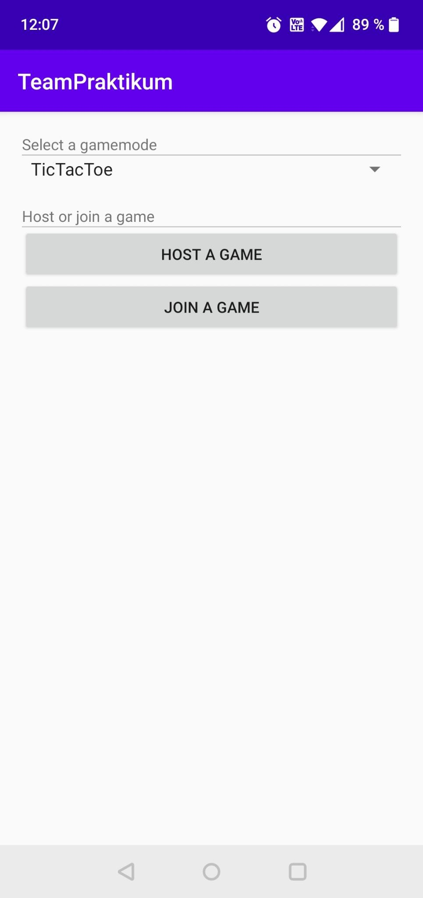

# Mobile Mixed Reality
This was a Teamproject of Oskar Hippe and David Eilers.
This project is a mobile mixed reality application on Android.
It uses _Googles_ `AR-Core` to create an AR-application,
the application implements 2 Games: TicTacToe and Four in a row is meant to be played on 2 devices on the same Wifi-Network.

# How to compile
Requirements:
* Android Studio
* Android SDK
* Android NDK

Used third Party libraries:
* GLM
* OpenGL ES
* ARCore

How to compile:
  * Clone repository in Android Studio `Git`->`Clone...`
  * Build
  * Run (on real hardware)
  > Note: ArCore did not run inside AVD containers in development

# Control

The application starts in the main Menue.
The user chooses the Game (TicTacToe, Four in a row) and decided to either
host or join a game.

When choosing host a game. The user gets a QR code and an IP-adress, the other user can connect to the game via the QR Code or using the IP-Address.

When choosing join a game, the user can scan the QR or type in the IP-address manually.
After this the user presses connect to start the game.
Local Connect runs the application locally without another smartphone.

When the Game starts, AR-Core searches for surfaces.

After the real surfaces are found the user clicks on the desired surface and the game field appears. With this the user can play the game.

If the user looses the game the user has the possibility of restarting the game.

